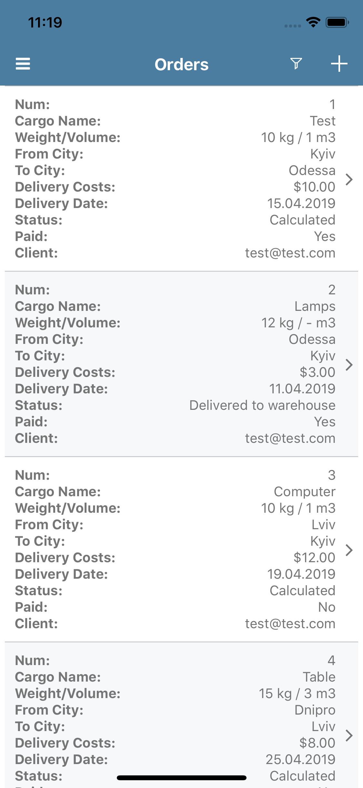
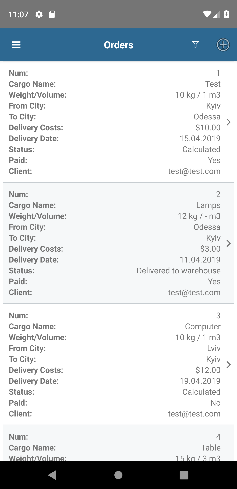
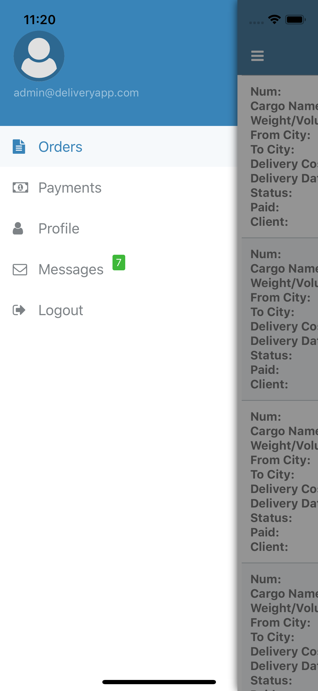
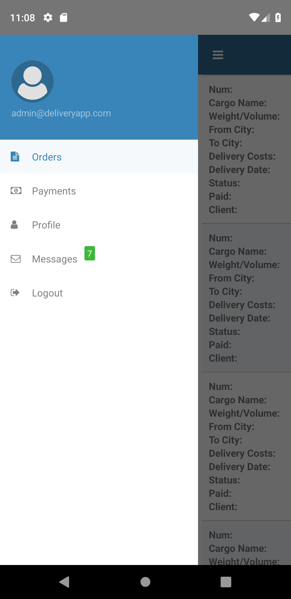
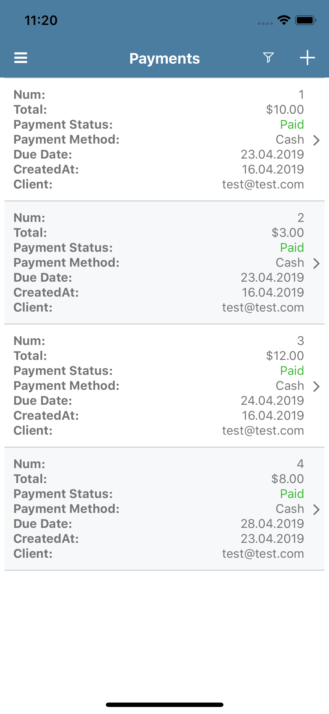
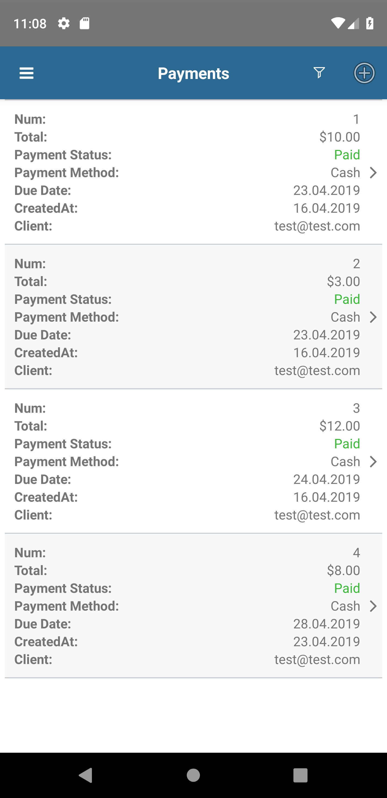

DeliveryApp (Angular, Nativescript-Angular)

This is client for https://github.com/denlysenko/deliveryapp-api

Web app can be found here:

https://deliveryapp-angular.netlify.app

Native apps some screenshots:

 

 

 

- [More Screenshots](screenshots/)

#### WARNING

Before launching mobile applications locally (or on the emulator) and building an ios / android application, make sure that you have the nativescript-plugin-firebase plugin installed (at the time of development it was ^ 9.0.1). Run this command `npm install nativescript-plugin-firebase@^9.0.1`. This package has been removed from package.json because installing it fails CI and deployment
